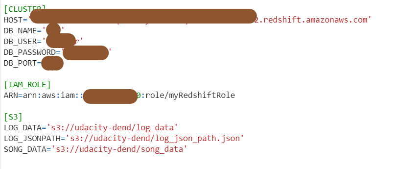

# Introduction
A music streaming startup, Sparkify, has grown their user base and song database and want to move their processes and data onto the cloud. Their data resides in S3, in a directory of JSON logs on user activity on the app, as well as a directory with JSON metadata on the songs in their app.
The goal of this project was to build an ETL pipeline for a database hosted on AWS Redshift using Python. 
To complete this project, I had to load streaming data from S3 to staging tables on Redshift and execute SQL statements that created the analytics tables from these staging tables, and then finally run queries to compare my results to the expected results.

# Database schema design and ETL process
Star schema was applied to this database design.

### Fact Table
tbl_songplay: records in log data associated with song plays i.e. records with page NextSong
### Dimension Tables
tbl_user: users in the app
tbl_song: songs in music database
tbl_artist: artists in music database
tbl_time: timestamps of records in songplays broken down into specific units

# Instruction
1. Create an IAM role that has a policy to have at least read only access to S3, and then create a Redshift cluster with it attached.
2. Configure the dwh.cfg file with AWS Redshift cluster configured user name DB_USER, password DB_PASSWORD, host name HOST, database name DB_NAME, port DB_PORT, and Amazon Resource Name ARN.

3. Run command python create_tables.py in terminal to create database and tables in Redshift cluster.
4. Run command python etl.py in terminal to extract, transform and load all records into Redshift.

